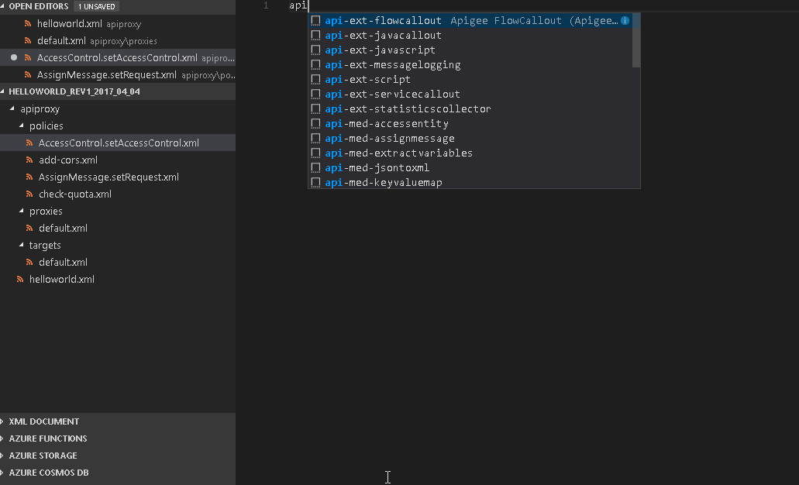

# Apigee Snippets for VS Code

**New Initial Release 0.0.1**

This extension for Visual Studio Code adds snippets for Apigee Policies.

See the [CHANGELOG](CHANGELOG.md) for the latest changes

## Usage

Type part of a snippet, press `enter`, and the snippet unfolds.

### Apigee Traffice Management Policies

| Snippet                      | Policy                                                       |
| ---------------------------- | ------------------------------------------------------------ |
| `api-tm-quota`               | `Quota` Policy                                               |
| `api-tm-spikearrest`         | `SpikeArrest` Policy                                         |
| `api-tm-concurrentratelimit` | `ConcurrentLateLimit` Policy                                 |
| `api-tm-responsecache`       | `ResponseCache` Policy                                       |
| `api-tm-lookupcache`         | `LookupCache` Policy                                         |
| `api-tm-populatecache`       | `PopulateCache` Policy                                       |
| `api-tm-invalidatecache`     | `InvalidateCache` Policy                                     |
| `api-tm-resetquota`          | `ResetQuota` Policy                                          |    

### Apigee Security Policies

| Snippet                         	 | Policy                                             |
| -------------------------------------- | -------------------------------------------------- |
| `api-sec-basicauthentication`   	 | `BasicAuthentication` Policy                       |
| `api-sec-xmlthreatprotection`	  	 | `XMLThreatProtection` Policy                       |
| `api-sec-jsonthreatprotection`  	 | `JSONThreatProctection` Policy                     |
| `api-sec-regularexpressionprotection`  | `RegularExpressionProtection` Policy               |
| `api-sec-oauthv2`         		 | `OAuth2` Policy                                    |
| `api-sec-getoauthv2info`       	 | `GetOAuth2Info` Policy                             |
| `api-sec-setoauthv2info`     		 | `SetOAuth2Info` Policy                             |
| `api-sec-deleteoauthv2info` 	         | `DeleteOAuth2Info` Policy                          |    
| `api-sec-verifyapikey`      		 | `VerifyAPIKey` Policy                              |
| `api-sec-accesscontrol`     		 | `AccessControl` Policy                             |
| `api-sec-generatesamlassertion`        | `GenerateSAMLAssertion` Policy                     |    
| `api-sec-validatesamlassertion`        | `ValidateSAMLAssertion` Policy                     |
| `api-sec-generatejwt`     		 | `GenerateJWT` Policy                               |
| `api-sec-verifyjwt`       		 | `VerifyJWT` Policy                                 |    
| `api-sec-decodejwt`       		 | `DecodeJWT` Policy                                 |    

### Apigee Mediation Policies

| Snippet                      | Policy                                                       |
| ---------------------------- | ------------------------------------------------------------ |
| `api-med-jsontoxml`          | `JSONToXML` Policy                                           |
| `api-med-xmltojson`          | `XMLToJSON` Policy                                           |
| `api-med-raisefault`	       | `RaiseFault` Policy                                          |
| `api-med-xsl`                | `XSL Transformation` Policy                                  |
| `api-med-messagevalidation`  | `SOAP MessageValidation` Policy                              |
| `api-med-assignmessage`      | `AssignMessage` Policy                                       |
| `api-med-extractvariables`   | `ExtractVariables` Policy                                    |
| `api-med-accessentity`       | `AccessEntitry` Policy                                       |    
| `api-med-keyvaluemap`	       | `KeyValueMapOperation` Policy                                |    

### Apigee Extension Policies

| Snippet                      | Policy                                                       |
| ---------------------------- | ------------------------------------------------------------ |
| `api-ext-javacallout`        | `JavaCallout` Policy                                         |
| `api-ext-script`     	       | `Python Script` Policy                                       |
| `api-ext-javascript` 	       | `Javascript` Policy                                          |
| `api-ext-servicecallout`     | `ServiceCallout` Policy                                      |
| `api-ext-flowcallout`        | `FlowCallout` Policy                                         |
| `api-ext-statisticscollector`| `StatisticsCollector` Policy                                 |
| `api-ext-messagelogging`     | `MessageLogging` Policy                                      |

Alternatively, press `Ctrl`+`Space` (Windows, Linux) or `Cmd`+`Space` (OSX) to activate snippets from within the editor.

## Installation

1. Install Visual Studio Code 1.17.0 or higher
1. Launch Code
1. From the command palette `Ctrl`-`Shift`-`P` (Windows, Linux) or `Cmd`-`Shift`-`P` (OSX)
1. Select `Install Extension`
1. Choose the extension
1. Reload Visual Studio Code

